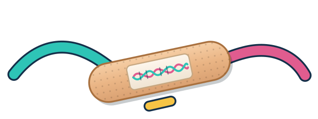
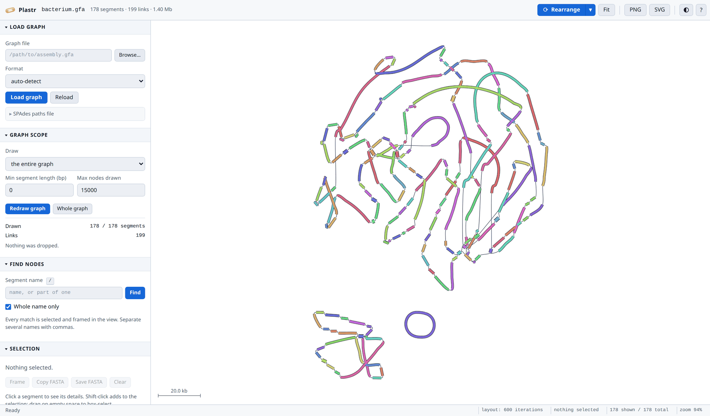
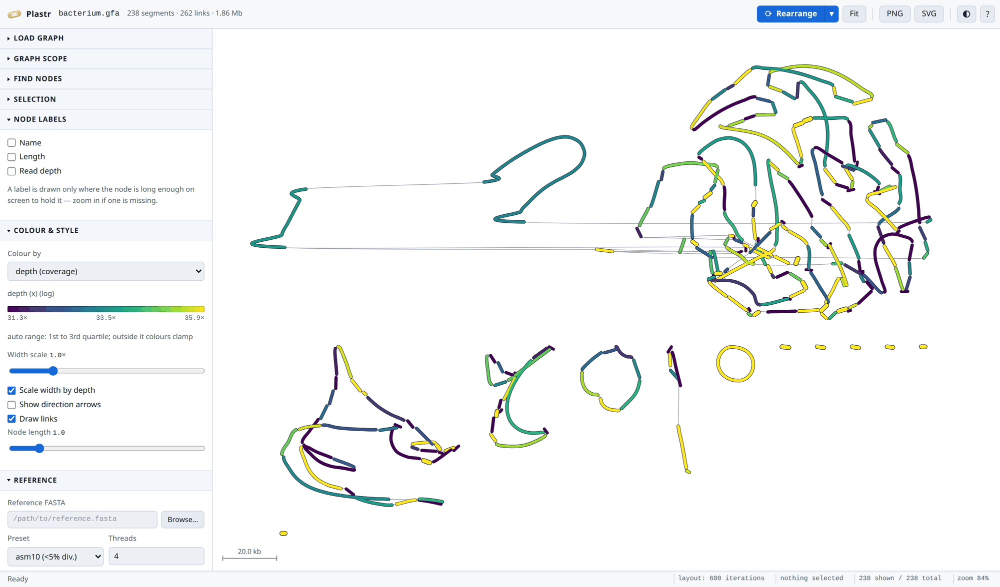
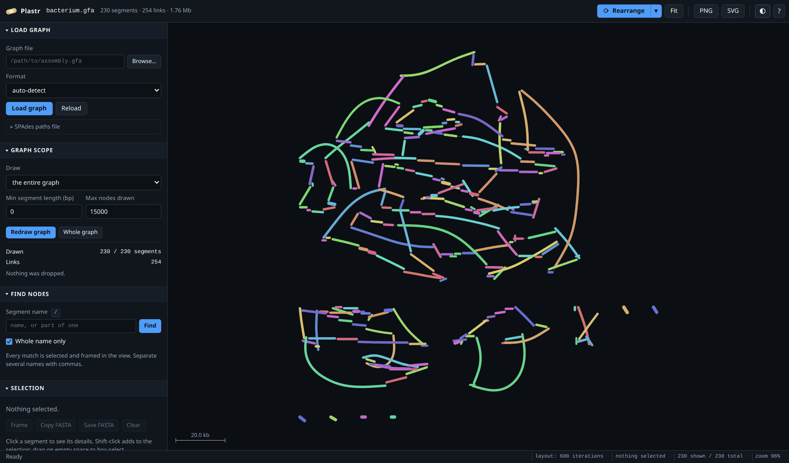
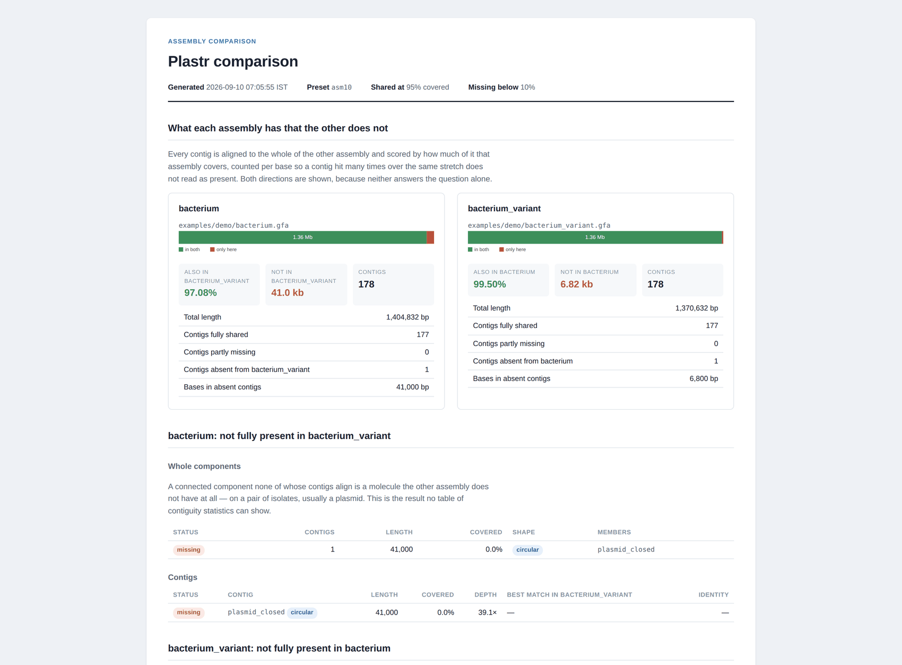
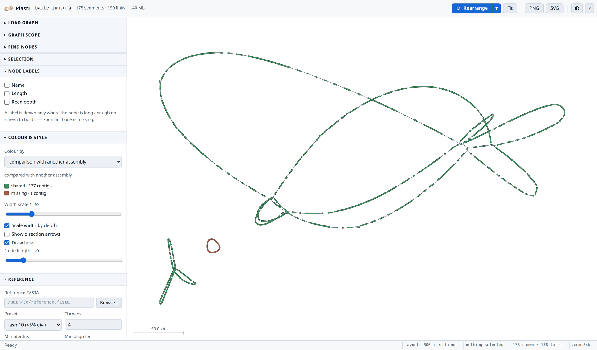
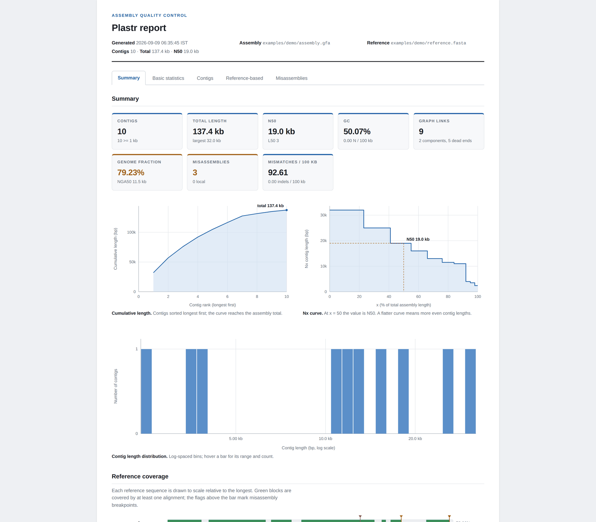

<p align="center">
  
</p>

<h1 align="center">Plastr</h1>

<p align="center">
  <em>A plaster for your assembly.</em><br>
  GFA visualisation, assembly quality assessment, and
  reference-guided scaffolding whose output you can actually use downstream.
</p>

<p align="center">
  <a href="#install">Install</a> ·
  <a href="#getting-started">Getting started</a> ·
  <a href="#the-studio">The studio</a> ·
  <a href="#command-line">Command line</a> ·
  <a href="#is-it-right">Validation</a>
</p>



---

Plastr exists because the two kinds of tool everyone reaches for after an
assembly answer different halves of the same question. A graph viewer shows you
the assembly but cannot tell you whether it is right, and cannot produce a
better one. An evaluator like QUAST tells you what is wrong but you cannot see
it or fix it. Plastr does both, and then lets you act on what you found: break
the misassembled contigs, order and orient the rest against a reference, fill
the gaps with real sequence recovered from the graph, and export scaffolds plus
a matching AGP.

The name is the British word for a sticking plaster, which is more or less what
this does to your assembly.

---

## Install

```bash
git clone https://github.com/iowa69/plaster.git && cd plaster
conda env create -f environment.yml
conda activate plastr
```

That is the whole install. It pulls in minimap2, mappy, BLAST, Node and the web
service, and gives you the `plastr` command.

> **Why conda and not pip?** `mappy` is minimap2's Python binding and ships as C
> source, so `pip install` has to compile it and fails on any machine without a
> C compiler. Conda takes a prebuilt one from bioconda. If you install with pip
> and skip `mappy`, everything reference-based silently disappears — alignment,
> misassembly detection, genome fraction, NA50/NGA50 and reference-guided
> scaffolding — and about a third of the test suite skips. `plastr doctor` will
> tell you if that has happened.

<details>
<summary>As a conda package</summary>

A conda recipe lives in [`conda/`](conda/). Build and install it locally with:

```bash
conda-build conda -c conda-forge -c bioconda
conda install -c local plastr
```

`conda install -c bioconda plastr` is not available yet — the recipe is ready
but has not been submitted to bioconda. Note the package is `plastr`, not
`plaster`: the latter is already taken on PyPI and in conda's `defaults`
channel by an unrelated Pylons library.
</details>

---

## Getting started

**1. Check the install and build the demo data.**

```bash
plastr doctor
python examples/make_demo_data.py
```

`doctor` reports what is present and, for anything missing, what you lose
without it. The demo builds two datasets in `examples/demo/`:

| File | What it is |
|---|---|
| `assembly.gfa` + `reference.fasta` | Ten contigs with **known** errors planted in them — one inversion, one relocation, one translocation, one contig with no reference match. Use this to check that the numbers are right. |
| `bacterium.gfa` | 178 segments, 1.40 Mb: one strain — a chromosome still in pieces, a draft plasmid, and one small plasmid that closed into a single circular contig. Collapsed repeats and bubbles where an assembler leaves them. Nothing planted; this one is for looking at. |
| `bacterium_variant.gfa` | A second isolate of that strain, a few SNPs apart, which has lost the plasmid and gained an insertion element. For `plastr diff`. |

**2. Open the graph.**

```bash
plastr view examples/demo/bacterium.gfa
```

Your browser opens on the drawing above. Everything else is in the sidebar.
Nothing is computed until you ask for it, so a graph opens immediately.

**3. Check whether the assembly is right.**

```bash
plastr qc examples/demo/assembly.gfa -r examples/demo/reference.fasta --preset asm5
```

This prints the statistics and then names each misassembly it found. On the
demo data it should find exactly the three that were planted:

```
  misassemblies                          3
    relocations                          1
    inversions                           1
    translocations                       1

  ! ctg_inversion       inversion      strand flips relative to the reference
  ! ctg_relocation      relocation     jumps 14,000 bp along chromosome (forward)
  ! ctg_translocation   translocation  contig continues on a different reference sequence
```

Add `--html report.html` for the full report.

**4. Fix it and scaffold it.**

```bash
plastr scaffold examples/demo/assembly.gfa -r examples/demo/reference.fasta \
    --break-misassemblies -o results/
```

This breaks the chimeric contigs at their breakpoints, orders and orients what
is left against the reference, fills gaps with real sequence taken from the
graph where it can, and writes `scaffolds.fasta`, `scaffolds.agp`, `graph.gfa`,
`segments.csv` and `report.html`.

---

## The studio

`plastr view assembly.gfa` opens the graph; `-r reference.fasta` loads a
reference at the same time.

### How the graph is drawn

Each segment is one polyline, drawn to the conventions a graph viewer is read
by:

- **Length is proportional to sequence length.** The scale is calibrated per
  graph so the mean contig comes out a readable size, which is what keeps the
  same picture legible for a 40 kb phage and a 5 Mb chromosome.
- **Width follows read depth**, but damped — a contig at four times the mean
  depth is about 1.5× the mean width, not four times it, so one runaway repeat
  cannot flatten everything else.
- **Connections are short and contigs are big.** A connection rests at an
  eighth of a mean contig, so what you read is the contigs, joined — not beads
  on strings. Edges are still drawn boldly enough to follow, and scale with the
  view rather than thinning to a hairline as you zoom in.
- **Edges leave a contig along its own direction**, as tangent-continuing
  curves, and each contig is splined towards what it joins, so a run of contigs
  reads as one flowing strand instead of bars meeting at corners.
- **A replicon is laid out as the loop it is.** A chromosome with repeats in it
  is a loop with chords, and starting it as a strand is what makes a long one
  fold up on itself; started as a loop it stays an open tuft, which is the shape
  the molecule actually has.
- **A closed molecule is drawn as a ring.** A complete circular plasmid — one
  contig whose two ends join, or several joined nose to tail — comes out round,
  because that is the fact you opened the viewer to confirm and a loop drawn as
  a straight bar hides it.
- **Separate components are packed into rows** — the big one first, the small
  ones underneath — instead of being scattered through each other.

**Rearrange** re-runs the layout over the whole graph, just your selection, or a
single component, in force-directed, linear, circular or component-grid mode.
Watch it settle; stop it when it looks right.

Export what you see as **PNG** or **SVG**. The SVG shares its geometry with the
on-screen painter, so the export matches the screen exactly.

### Colour schemes

Pick one under **Colour & style**. The legend below the picker always shows what
the colours currently mean.

| Scheme | What it shows |
|---|---|
| **random per segment** | A distinct stable hue per contig — the default, and the best way to see where one contig ends and the next begins |
| **uniform** | One colour for everything |
| **depth (coverage)** | A ramp over read depth. The range defaults to the **first and third quartiles**, so a single 500× repeat cannot squeeze every ordinary contig into one end of the ramp; anything outside clamps |
| **GC content** | A ramp over GC fraction |
| **length** | A ramp over contig length |
| **connected component** | One colour per component |
| **scaffold (GFA path)** | One colour per `P`-line, so the contigs the assembler says are one molecule read as one molecule. Contigs in no path stay grey, so what is scaffolded and what is not shows at a glance |
| **comparison** | Green, amber and red for shared, partly missing and absent, once a second assembly is loaded with `--diff` |
| **random per component** | As above, with unrelated hues |
| **reference chromosome** | Which reference sequence each part aligned to, painted as sub-spans along the contig |
| **search / BLAST hit** | Where your query hit, painted along the contig; optionally in rainbow order by position in the query |



*Colour by depth. The auto range is the first to third quartile — the collapsed
repeats sit above it and clamp to the top of the ramp.*

### Choosing what to draw

Large graphs are easier to read in pieces. **Graph scope** decides what is drawn:

| Scope | Use it to |
|---|---|
| **the entire graph** | Draw everything |
| **nodes around a selection** | Name some contigs and draw everything within *N* steps of them. Matching is on whole names by default; untick *Whole name only* for substring matching |
| **nodes within a depth range** | Show only contigs in a depth band — a quick way to isolate collapsed repeats or low-coverage junk |
| **one connected component** | Draw a single component |

An edge is drawn only when both its contigs are in scope, so the picture never
implies a join to something you cannot see. If the result is still larger than
**Max nodes drawn**, Plastr grows
outward from the scope's own contigs, so what you get stays connected — it does
*not* keep the longest contigs and hand you a field of unconnected fragments.
The panel always says what it dropped and why.

### Finding things

Press <kbd>/</kbd>, type a contig name, press <kbd>Enter</kbd>. Every match is
selected and framed. Separate several names with commas.

### Working with a selection

Click a contig to select it, <kbd>Shift</kbd>-click to add, or
<kbd>Shift</kbd>-drag on the background to rectangle-select. The **Selection**
panel then shows how many contigs, their total length and mean depth, and can
**copy** or **save** their sequences as FASTA.

### Labels and settings

**Node labels** draws the name, length and read depth on each contig, at the
contig's centre and at a near-constant size as you zoom. A label appears only
where the contig is long enough on screen to hold it.

**Settings** exposes the drawing constants — node width, the two depth-to-width
shaping parameters, node length per megabase and whether it is calibrated
automatically, outlines, text size. They persist between sessions.

### Keyboard and mouse

| | |
|---|---|
| <kbd>R</kbd> | Rearrange (re-run the layout) |
| <kbd>F</kbd> | Fit the graph to the view |
| <kbd>/</kbd> or <kbd>Ctrl</kbd>+<kbd>F</kbd> | Find contigs by name |
| <kbd>A</kbd> | Select all visible contigs |
| <kbd>C</kbd> | Copy the selected sequences as FASTA |
| <kbd>Del</kbd> | Delete the selected contigs |
| <kbd>Ctrl</kbd>+<kbd>Z</kbd> | Undo |
| <kbd>Esc</kbd> | Clear the selection |
| <kbd>?</kbd> | Show all shortcuts |
| Wheel | Zoom, centred on the cursor |
| Drag background | Pan |
| Double-click a contig | Centre on it |

The canvas takes keyboard focus like any other control, so arrow keys pan and
<kbd>+</kbd>/<kbd>-</kbd> zoom once you <kbd>Tab</kbd> to it.

### Dark theme

The button in the top right switches themes; the drawing is designed for both.



---

## Command line

Everything the studio does also runs headlessly, so Plastr fits a pipeline as
well as it fits a screen.

| Command | What it does |
|---|---|
| `plastr view` | Open the studio |
| `plastr info` | One-screen summary of a graph |
| `plastr qc` | Quality report, with reference evaluation if you give it one |
| `plastr scaffold` | Break misassemblies, scaffold, export |
| `plastr search` | Find a sequence in the assembly |
| `plastr compare` | Several assemblies side by side, statistic by statistic |
| `plastr diff` | Two assemblies compared **by content**: what one has that the other does not |
| `plastr export` | Write the graph, per-contig CSV and report |
| `plastr doctor` | Check what is installed |

```bash
# Quality report, with reference evaluation
plastr qc assembly.gfa -r reference.fasta --html report.html

# Break misassemblies, scaffold against the reference, export everything
plastr scaffold assembly.gfa -r reference.fasta \
    --break-misassemblies -o results/

# Where is this gene?
plastr search assembly.gfa --query gene.fasta

# Two assemblers, one reference, side by side
plastr compare spades.gfa mine.gfa -r reference.fasta --html compare.html

# What does this isolate carry that the other one does not?
plastr diff isolate_A.gfa isolate_B.gfa --html gained_and_lost.html
```

### Comparing two assemblies by content

`plastr compare` answers "which assembly is better". It cannot answer "what did
I gain, and what did I lose", because two assemblies with identical N50 and
identical total length can still disagree about a whole plasmid.

`plastr diff` aligns every contig to the whole of the other assembly and scores
it by how much of it that assembly covers. Coverage is counted **per base**, so
a contig hit six times over the same third of itself does not read as present,
and alignments are deliberately not split at long indels, so a contig whose
middle the other assembly lacks reads as partial rather than shared.

Both directions are reported, because neither answers the question alone.

The result worth having is not the percentage but the list: the contigs one
assembly has and the other does not, and above all the **connected components
that never align at all**. On a pair of isolates that is a plasmid one carries
and the other does not — the thing no table of contiguity statistics can show,
and the reason this is useful for mobile elements and small contigs.

The demo builds a second isolate of the same strain, so you can run it now:

```bash
plastr diff examples/demo/bacterium.gfa examples/demo/bacterium_variant.gfa \
    --html comparison.html
```

The two isolates are a few SNPs apart — the same organism sequenced twice — but
one has lost a plasmid and the other has gained an insertion element:

```
  bacterium
    also in bacterium_variant          1.36 Mb  (97.08 %)
    contigs shared / partial / missing    177 /     0 /     1

    Components not fully in bacterium_variant
    ------------------------------------------------------
    !   1 contig(s)    41.00 kb  circular  missing    0.0 % covered

  bacterium_variant
    also in bacterium                  1.36 Mb  (99.50 %)

    Components not fully in bacterium
    ------------------------------------------------------
    !   1 contig(s)     6.80 kb  linear    missing    0.0 % covered
```

Note that both assemblies are ~1.4 Mb with 178 contigs and near-identical N50.
Every side-by-side statistic says they are the same assembly. They are not.



*The report: each assembly as a bar of what the other one covers, then the
components and contigs not fully present, in both directions.*

#### Seeing it rather than reading it

```bash
plastr view examples/demo/bacterium.gfa --diff examples/demo/bacterium_variant.gfa
```

The studio gains a **comparison** colour mode: shared contigs green,
partly-missing amber, and the ones the other assembly does not have at all red.
A lost plasmid stops being a row in a table and becomes a red ring sitting next
to a green chromosome.



---

## What it does

### Judges the assembly

Reference-free: contigs, N50/L50, N75, NG50, auN, GC, depth distribution, dead
ends, connected components, circular contigs, and the graph-level numbers that
tell you what kind of assembly you have — edge overlap range, total length
corrected for overlaps, percentage of dead ends, largest component and its
share, length held in orphaned contigs, the length quartiles, and an estimate of
how much sequence the assembly really represents.

Reference-based, once you drop a reference FASTA in: genome fraction,
duplication ratio, NA50/NGA50, mismatches and indels per 100 kb, and
misassemblies classified the way QUAST classifies them — relocation, inversion,
translocation, and local misassembly.

One detail worth knowing: minimap2 will carry a single alignment straight across
a multi-kilobase deletion and record it as one long `D` in the CIGAR. Left
alone, that hides real structural error *and* inflates genome fraction, because
the untouched span between alignment start and end counts as covered.
Plastr splits alignments at long indels before scoring, which is why its
genome fraction is lower — and correct — compared to a naive PAF summary.



*The HTML report is one self-contained file with no CDN links and no chart
library. Headline statistics, Nx and cumulative curves, a per-contig table you
can sort, a to-scale reference ideogram with misassembly breakpoints flagged,
and the misassemblies named one by one.*

### Fixes and scaffolds

**Break misassemblies** splits contigs at the detected breakpoints. This is the
step that turns a QC report into an improvement: a chimeric contig joining a
chromosome and a plasmid stops being one wrong contig and becomes two right
ones, each of which can then be placed correctly.

**Reference-guided scaffolding** aligns contigs, orders and orients them by
reference coordinate, and sizes gaps from reference distance. Contigs whose
placements overlap substantially are reported as redundant rather than silently
interleaved, because a contig landing on top of another is usually a collapsed
repeat and stacking them produces a scaffold nobody should trust. Contigs that
cannot be placed are kept as unplaced singletons, not dropped.

**Graph-aware gap filling** is the part that makes the output better than
reference scaffolding alone. Where the assembly graph contains a path between
two neighbouring contigs of roughly the estimated gap length, that path's real
sequence replaces the run of Ns. The sequence comes from your reads, not from
the reference. Where two plausible paths of similar length exist, Plastr
leaves Ns rather than guessing.

The scaffold plan is then **editable**: drag members to reorder them within or
between scaffolds, flip orientation, adjust gap sizes, split a scaffold. Manual
edits and the automatic method share one code path, so a hand-tuned scaffold
exports exactly as reliably as a computed one.

### Exports things you can use

`scaffolds.fasta` and `scaffolds.agp` are generated in a single pass from one
coordinate counter, so the AGP always describes the FASTA exactly — every
component row slices to the oriented contig sequence, every gap row is exactly
that many Ns. This is checked in the test suite and it is not negotiable: a
mismatched AGP is worse than no AGP, because downstream tools trust it.

Also exports the edited graph as GFA, a per-segment CSV (with reference
placement and scaffold assignment columns, ready for R or pandas), a
self-contained HTML report, and a session file so you can pick an analysis
back up later.

---

## Is it right?

Plastr is checked against the tools it replaces, on real bacterial
assemblies rather than on data it generated itself. Full numbers and commands
are in [`docs/VALIDATION.md`](docs/VALIDATION.md).

**Against an established assembly-graph viewer**, on two real graphs (2.88 Mb
and 5.45 Mb, with 94 bp and 127 bp overlaps): node count, edge count, total
length, dead ends, connected components, N50, longest node, largest component
and median depth all agree exactly. The tool and the commands are named in
[`docs/VALIDATION.md`](docs/VALIDATION.md).

**Against QUAST**, on six closed *Klebsiella pneumoniae* genomes: contig
counts, total length, largest contig, GC, N50, NG50, L50, auN, genome fraction,
duplication ratio, NA50, NGA50, largest alignment, total aligned length,
unaligned contigs and **misassembly counts** agree exactly on every genome. The
two most alignment-sensitive statistics — local misassemblies and the
mismatch/indel rate — differ slightly on three of the six, in the way different
aligner settings differ. Use `--min-contig 500` to match QUAST's default contig
filter.

That comparison found two real bugs, neither of which synthetic data exposed:
contigs spanning a circular replicon's origin were being reported as
relocations, and secondary alignments were inflating every reference statistic
(total aligned length exceeded the assembly's own length). Both are fixed and
covered by regression tests.

**Scaffolding, scored by QUAST rather than by Plastr:** 63 contigs became 5
scaffolds, N50 rose from 444 kb to 5.26 Mb, the chromosome was reconstructed as
a single 5.26 Mb scaffold, and genome fraction went *up* from 98.57% to 99.57%
— with **zero misassemblies introduced** and no change in duplication ratio.

---

## A note on running it

`plastr view` starts a small web server bound to `127.0.0.1`, so by default
it is reachable only from your own machine. It is a desktop tool that happens to
use a browser for its interface.

It has **no authentication**, and by design it can read any file you can read —
that is what makes the file picker work. So if you change `--host`, everyone who
can reach that port gets a filesystem browser, a file reader, and the ability to
write exports as you. On a shared machine or a cluster login node, don't. If you
need the interface on a remote machine, forward the port over SSH instead:

```bash
ssh -L 8781:127.0.0.1:8781 you@remote     # then open http://127.0.0.1:8781
```

Plastr prints a warning if you bind it anywhere other than loopback.

Exports refuse to overwrite existing files unless you ask them to, since the
output directory is the one place the tool can destroy work you did not create.
Pass `--overwrite` to `plastr scaffold` or `plastr export` when replacing an
earlier run is what you want.

---

## Input formats

| Format | Notes |
|---|---|
| GFA 1.0 | `S`/`L`/`P`/`W` lines; depth from `dp`, `DP`, `KC`, `RC`, `FC` tags |
| GFA 2.0 | `S`/`E`/`O`/`U` lines |
| FASTG | SPAdes dialect, reverse-complement records folded together |
| FASTA | contigs only — no edges, but QC, alignment, and scaffolding all still work |
| SPAdes `contigs.paths` | attach with `--paths` |

Gzipped input is read transparently. Format detection is automatic;
`--format` overrides it.

---

## Library use

Everything the GUI does is available from Python:

```python
from plastr import Project

p = Project()
p.load("assembly.gfa")
p.set_reference("reference.fasta", preset="asm5")

print(f"genome fraction {p.reference_report.genome_fraction:.2f}%")
print(f"{p.reference_report.num_misassemblies} misassemblies")

p.apply_operation("break_misassemblies", {"extensive_only": True})
p.refresh_reference()
p.build_plan(method="reference")
p.export("out/", ["scaffolds", "agp", "report"])
```

The HTTP API is documented in [`docs/API.md`](docs/API.md) and browsable at
`/api/docs` while the server runs.

---

## Development

```bash
conda activate plastr
python -m pytest tests/ -v
```

That runs the browser-side tests too. The drawing is most of what you actually
look at, so `tests/js/` covers the geometry and layout contracts — that a
contig's drawn length tracks its bases at any assembly size, that a long contig
gets enough vertices to curve, that joined contigs come to rest end to end, and
that separate components do not overlap. They run under Node's own test runner,
so there is still no `package.json`, nothing to install and no build step. Node
comes from `environment.yml`; without it those tests skip and the Python suite
is unaffected.

The design document is in
[`docs/superpowers/specs/`](docs/superpowers/specs/). The layering is strict:
`core/` is pure Python with no web knowledge, `server/` shapes JSON and contains
no biology, `web/` is static files with no build step.

## Licence

MIT.
