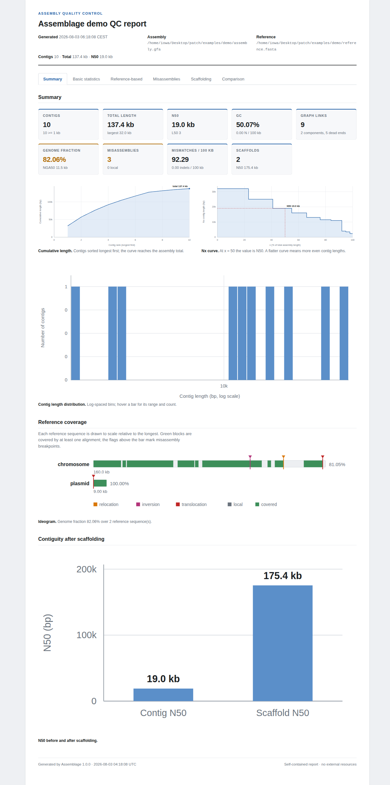

# Assemblage

**Interactive assembly graph studio** — Bandage-style visualisation, QUAST-style
quality assessment, and reference-guided scaffolding whose output you can
actually use downstream.

Assemblage exists because the two tools everyone reaches for after an assembly
answer different halves of the same question. Bandage shows you the graph but
cannot tell you whether it is right, and cannot produce a better assembly.
QUAST tells you what is wrong but you cannot see it or fix it. Assemblage does
both, and then lets you act on what you found: break the misassembled contigs,
order and orient the rest against a reference, fill the gaps with real sequence
recovered from the graph, and export scaffolds plus a matching AGP.

---

## Install

```bash
git clone <this repo> assemblage && cd assemblage
conda env create -f environment.yml
conda activate assemblage
```

That is the whole install. It pulls in minimap2, mappy, BLAST, and the web
service, and installs the `assemblage` command.

Check that everything is present, then generate a small demo dataset with known
errors built into it:

```bash
assemblage doctor
python examples/make_demo_data.py
assemblage qc examples/demo/assembly.gfa -r examples/demo/reference.fasta --preset asm5
```

`assemblage doctor` reports what is installed and, for anything missing, what
you lose without it.

## Use it

```bash
assemblage view assembly.gfa                          # open the studio
assemblage view assembly.gfa -r reference.fasta       # ...with a reference already loaded
```

Your browser opens on the graph. Everything else is in the sidebar.

The same operations run headlessly, so Assemblage fits a pipeline as well as it
fits a screen:

```bash
# Quality report, with reference evaluation
assemblage qc assembly.gfa -r reference.fasta --html report.html

# Break misassemblies, scaffold against the reference, export everything
assemblage scaffold assembly.gfa -r reference.fasta \
    --break-misassemblies -o results/

# Where is this gene?
assemblage search assembly.gfa --query gene.fasta

# Quick look
assemblage info assembly.gfa

# Two assemblers, one reference, side by side
assemblage compare spades.gfa mine.gfa -r reference.fasta --html compare.html
```

`assemblage scaffold` writes `scaffolds.fasta`, `scaffolds.agp`, `graph.gfa`,
`segments.csv`, and `report.html` into the output directory.

---

## What it does

### Sees the graph

Segments are drawn as length-proportional polylines with depth-scaled width, in
the double-stranded convention Bandage users expect. Colour by depth, GC,
length, connected component, reference chromosome, or search hit. Pan, zoom,
box-select, drag.

**Rearrange** is a first-class control, not something you get by reloading. Re-run
the layout over the whole graph, just your selection, or a single component, in
force-directed, linear, circular, or component-grid mode. Watch it settle, stop
it when it looks right.

Export the view as PNG or SVG, because figures are half of why people open a
graph viewer.

### Judges the assembly

Reference-free: contigs, N50/L50, N75, NG50, auN, GC, depth distribution, dead
ends, connected components, circular contigs.

Reference-based, once you drop a reference FASTA in: genome fraction,
duplication ratio, NA50/NGA50, mismatches and indels per 100 kb, and
misassemblies classified the way QUAST classifies them — relocation, inversion,
translocation, and local misassembly.

One detail worth knowing: minimap2 will carry a single alignment straight across
a multi-kilobase deletion and record it as one long `D` in the CIGAR. Left
alone, that hides real structural error *and* inflates genome fraction, because
the untouched span between alignment start and end counts as covered.
Assemblage splits alignments at long indels before scoring, which is why its
genome fraction is lower — and correct — compared to a naive PAF summary.



*The HTML report for the demo dataset: headline statistics, Nx and cumulative
curves, a to-scale reference ideogram with misassembly breakpoints flagged, and
N50 before and after scaffolding.*

### Fixes and scaffolds

**Break misassemblies** splits contigs at the detected breakpoints. This is the
step that turns a QC report into an improvement: a chimeric contig joining a
chromosome and a plasmid stops being one wrong contig and becomes two right
ones, each of which can then be placed correctly.

**Reference-guided scaffolding** aligns contigs, orders and orients them by
reference coordinate, and sizes gaps from reference distance. Contigs whose
placements overlap substantially are reported as redundant rather than silently
interleaved, because a contig landing on top of another is usually a collapsed
repeat and stacking them produces a scaffold nobody should trust. Contigs that
cannot be placed are kept as unplaced singletons, not dropped.

**Graph-aware gap filling** is the part that makes the output better than
reference scaffolding alone. Where the assembly graph contains a path between
two neighbouring contigs of roughly the estimated gap length, that path's real
sequence replaces the run of Ns. The sequence comes from your reads, not from
the reference. Where two plausible paths of similar length exist, Assemblage
leaves Ns rather than guessing.

The scaffold plan is then **editable**: drag members to reorder them within or
between scaffolds, flip orientation, adjust gap sizes, split a scaffold. Manual
edits and the automatic method share one code path, so a hand-tuned scaffold
exports exactly as reliably as a computed one.

### Exports things you can use

`scaffolds.fasta` and `scaffolds.agp` are generated in a single pass from one
coordinate counter, so the AGP always describes the FASTA exactly — every
component row slices to the oriented contig sequence, every gap row is exactly
that many Ns. This is checked in the test suite and it is not negotiable: a
mismatched AGP is worse than no AGP, because downstream tools trust it.

Also exports the edited graph as GFA, a per-segment CSV (with reference
placement and scaffold assignment columns, ready for R or pandas), a
self-contained HTML report, and a session file so you can pick an analysis
back up later.

---

## Is it right?

Assemblage is checked against the tools it replaces, on real bacterial
assemblies rather than on data it generated itself. Full numbers and commands
are in [`docs/VALIDATION.md`](docs/VALIDATION.md).

**Against Bandage**, on two real graphs (2.88 Mb and 5.45 Mb, with 94 bp and
127 bp overlaps): node count, edge count, total length, dead ends, connected
components, N50, longest node, largest component and median depth all agree
exactly.

**Against QUAST**, on six closed *Klebsiella pneumoniae* genomes: contig
counts, total length, largest contig, GC, N50, NG50, L50, auN, genome fraction,
duplication ratio, NA50, NGA50, largest alignment, total aligned length,
unaligned contigs and **misassembly counts** agree exactly on every genome. The
two most alignment-sensitive statistics — local misassemblies and the
mismatch/indel rate — differ slightly on three of the six, in the way different
aligner settings differ. Use `--min-contig 500` to match QUAST's default contig
filter.

That comparison found two real bugs, neither of which synthetic data exposed:
contigs spanning a circular replicon's origin were being reported as
relocations, and secondary alignments were inflating every reference statistic
(total aligned length exceeded the assembly's own length). Both are fixed and
covered by regression tests.

**Scaffolding, scored by QUAST rather than by Assemblage:** 63 contigs became 5
scaffolds, N50 rose from 444 kb to 5.26 Mb, the chromosome was reconstructed as
a single 5.26 Mb scaffold, and genome fraction went *up* from 98.57% to 99.57%
— with **zero misassemblies introduced** and no change in duplication ratio.

---

## Input formats

| Format | Notes |
|---|---|
| GFA 1.0 | `S`/`L`/`P`/`W` lines; depth from `dp`, `DP`, `KC`, `RC`, `FC` tags |
| GFA 2.0 | `S`/`E`/`O`/`U` lines |
| FASTG | SPAdes dialect, reverse-complement records folded together |
| FASTA | contigs only — no edges, but QC, alignment, and scaffolding all still work |
| SPAdes `contigs.paths` | attach with `--paths` |

Gzipped input is read transparently. Format detection is automatic;
`--format` overrides it.

---

## Library use

Everything the GUI does is available from Python:

```python
from assemblage import Project

p = Project()
p.load("assembly.gfa")
p.set_reference("reference.fasta", preset="asm5")

print(f"genome fraction {p.reference_report.genome_fraction:.2f}%")
print(f"{p.reference_report.num_misassemblies} misassemblies")

p.apply_operation("break_misassemblies", {"extensive_only": True})
p.refresh_reference()
p.build_plan(method="reference")
p.export("out/", ["scaffolds", "agp", "report"])
```

The HTTP API is documented in [`docs/API.md`](docs/API.md) and browsable at
`/api/docs` while the server runs.

---

## Development

```bash
conda activate assemblage
python -m pytest tests/ -v
```

The design document is in
[`docs/superpowers/specs/`](docs/superpowers/specs/). The layering is strict:
`core/` is pure Python with no web knowledge, `server/` shapes JSON and contains
no biology, `web/` is static files with no build step.

## Licence

MIT.
